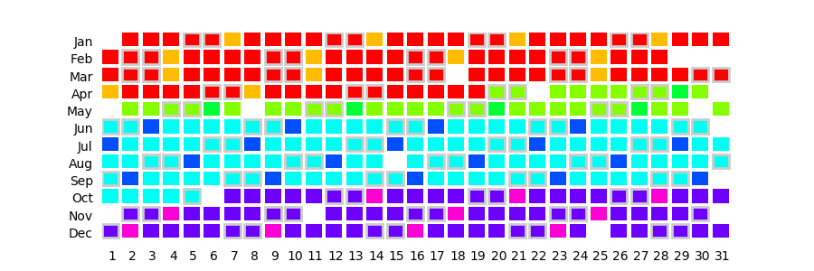

# Scripts pour le traitement de données GTFS

Ce répertoire contient des scripts python utiles au traitement des données GTFS.  
Certains se verront intégrés au sein de l'extension TempusAccess

## Script de génération d'images de calendriers de services
Le script [`display_calendar.py`](https://github.com/CEREMA/territoires-ville.TempusAccess/blob/master/scripts_py/display_calendar.py) permet de générer un calendrier de services depuis une donnée GTFS.

Le nom du répertoire GTFS doit être indiqué au sein de la fonction :

	# CAPA
	plot_capa = display_calendar_for_gtfs("gtfs_data/capa_GTFS_022019/")
	
	# save as png and show
	plot_capa.savefig("capa.png")
	plot_capa.show()

### Résultat

Dans l'image générée, chaque couleur correspond à une période de service (correspondant à la colonne `service_id`). Les carrés entourés de gris correspondent aux Samedis et aux Dimanches. Les carrés blancs sont les jours pour lesquels il n'y a aucun service.

### Dépendances
La librairie `matplotlib` devra être installée pour utiliser ce script ainsi que la librairie `pandas`

